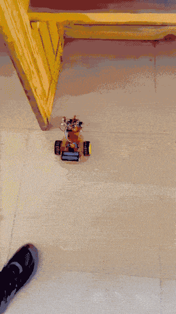
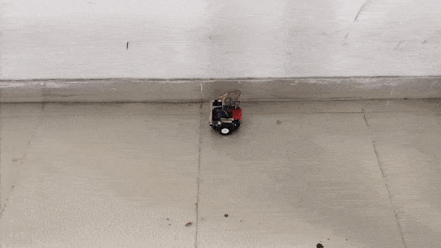

# Wall-Following Robot with PID Control

An autonomous wall following robot using ultrasonic sensors with **PID control** for smooth and stable wall tracking. This project includes both **right-wall** and **left-wall** following implementations. This is an advanced version of the [bang-bang controlled wall-following robot](https://github.com/aqib-m31/Wall-Following-Robot) that eliminates oscillations and maintains a constant safe distance from the wall.

## Implementations

### Right-Wall Following ([WallFollowingRobotPID.ino](WallFollowingRobotPID.ino))
The program was tested on _AlphaBot2-Ar_, with two additional ultrasonic sensors mounted on the left and right sides. The left and right sensors were mounted slightly forward (near the front) to improve corner detection. Uses three ultrasonic sensors (front, left, and right). The left ultrasonic sensor could be used for left-wall following on the same platform.

### Left-Wall Following ([LeftWallFollowingRobotPID.ino](LeftWallFollowingRobotPID.ino))
Tested on a custom robot. Uses two ultrasonic sensors (front and left).

## Working Principle

1. **Sensors**:

   - Ultrasonic sensors measure distance to walls.
   - The left and right sensors were mounted slightly forward (near the front) rather than at the center to improve corner detection.

2. **Control Logic (PID)**:

   - **PID controller** continuously adjusts motor speeds based on the error between the desired distance (setpoint) and actual distance from the wall.
   - **Proportional (Kp)**: Responds to current error magnitude
   - **Integral (Ki)**: Eliminates steady-state error over time
   - **Derivative (Kd)**: Dampens oscillations and predicts future error
   - **Right-wall following: Front wall → turn left in place | No wall on right → turn right**
   - **Left-wall following: Front wall → turn right in place | No wall on left → turn left**
   - **PID-controlled forward motion with differential steering** maintains consistent wall distance

3. **Turns**:

   - Differential steering (varying left and right motor speeds) is used for smooth wall following along curves.
   - In-place turns are used for 90° sharp turns when a front wall is detected to prevent collision.

4. **Motor Speed Calibration**:
   - Base speed, minimum speed, and maximum speed thresholds were tuned to ensure smooth operation.
   - PID gains (Kp, Ki, Kd) were experimentally adjusted to achieve stable wall-following without oscillation.
   - **Note**: Speed values differ between implementations due to different robot platforms and motor characteristics.

## Improvements Over Bang-Bang Control

- **Smoother motion**: PID control eliminates the flickering/oscillating behavior seen with bang-bang control
- **Constant distance**: Maintains a more precise and stable distance from the wall
- **Better corner handling**: Gradual steering adjustments prevent overshooting during turns

## Demo
| Left-Wall Following | Right-Wall Following |
|:---:|:---:|
|  | |

## Problems Faced

- **PID gain tuning (Kp, Ki, Kd)**: Finding the optimal values required experimentation to balance responsiveness and stability. Too high Kp caused oscillations, while too low Kd resulted in sluggish response.
- **Motor speed threshold tuning**: The minimum and maximum speed limits had to be carefully calibrated to prevent motor stalling while maintaining effective steering control.
- **Platform-specific calibration**: Each robot platform requires individual tuning of speed constants and PID parameters due to different motor characteristics and weight distribution.

## Assumptions

- The robot should initially start within the predefined safe distance from the wall to ensure proper wall-following behavior.
- Robot operates in an environment with walls for guidance (right wall for right-wall following, left wall for left-wall following).
- Floor surface is even and provides sufficient traction for controlled turns.
- All sensors are functioning and mounted correctly (The left and right sensors are mounted toward the front corners of the robot, still facing directly left and right, to improve wall detection during turns).
- PID control is implemented for smooth and stable wall-following with continuous error correction.
